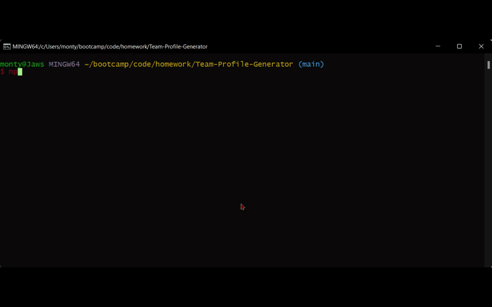

 # Team Profile Generator
 
 
##  What is the project?

This class project is to create a CLI tool with Node.js that generates an employee management HTML page.

About:

- The tool allows for a manager, engineer and intern to be added  

- The code uses Jest JS for unit testing. 

- The code uses inquirer to run the code.

- The tool outputs an HTML document with user supplied employees

<br>

## Technologies Used

Javascript <br> 
Node JS <br> 
Inquirer <br> 
fs write <br> 
Jest JS
Markdown <br>


## How to use

- To get a local copy up and running follow these simple example steps.

1. Clone the repository down to your local machine.
```
get clone gh repo clone Montyking20/Team-Profile-Generator
```
2. cd into it from the terminal.

3. Install necessary packages -- 
  ```
  npm i inquirer
  npm i jest
   ```
### How to test
```
 npm test
```




### How to run

```
npm start
```


<br>
<br>

## Links

### [Team-Profile-Generator](https://montyking20.github.io/Team-Profile-Generator/)

<br>
<br>

## What it looked like


<br>

## Other examples

_For more examples, please refer to the [VIDEO](./Assets/Video/Team-Profile-Generator.webm)_

_For more examples, please refer to the [VIDEO](./Assets/Video/Team-Profile-Generator.webm)_

_For more examples, please refer to the [VIDEO](./Assets/Video/Team-Profile-Generatornpmtest.webm)_

_For more examples, please refer to the [VIDEO](./Assets/Video/Team-Profile-Generatornpmstart.webm)_